number: "1132255972"

## 1. Цель работы
- Получите практические навыки установки операционной системы (Linux Fedora) на виртуальную машину.
- Научитесь настраивать основные службы, необходимые после запуска системы.
- Ознакомьтесь с основными функциями и операциями командной строки VirtualBox.
- Научитесь анализировать информацию о запуске системы для получения данных об оборудовании и ядре.

## 2. Порядок выполнения работы и результаты

### 2.1 Шаг 1: Установите VirtualBox и скачайте ISO-образ Fedora Sway.
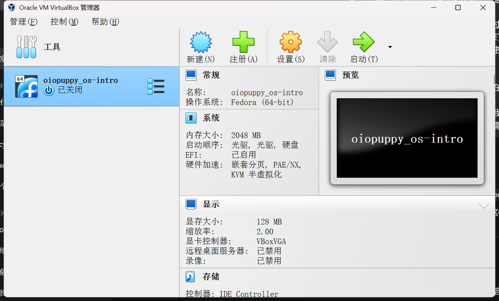
* **Результат:** VirtualBox успешно установлен, и ISO-файл сохранен локально.

### 2.2 Шаг 2: Создайте рабочую директорию и настройте VirtualBox.
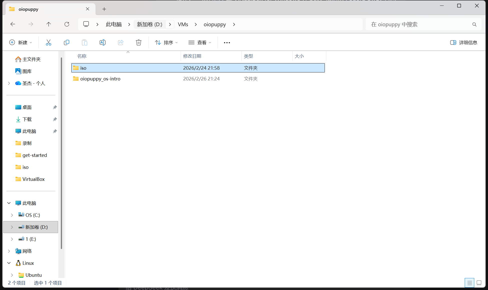
    ```cmd
    d:
    mkdir D:\VMs\haoczan2
    mkdir D:\VMs\haoczan2\iso
    ```
    Переместите ISO-образ в папку `D:\VMs\haoczan2\iso\`.
    Затем настройте глобальные параметры VirtualBox в командной строке:
    ```cmd
    VBoxManage setproperty language C
    VBoxManage setproperty machinefolder D:\VMs\haoczan2
    VBoxManage setextradata global GUI/Input/HostKeyCombination 65383
    VBoxManage list systemproperties | find "Default machine folder:"
    ```
**Результат:** Папка виртуальной машины по умолчанию установлена ​​на `D:\VMs\haoczan2`, а ключ Host изменен на ключ Menu во избежание конфликтов.

### 2.3 Шаг 3: Создайте виртуальную машину
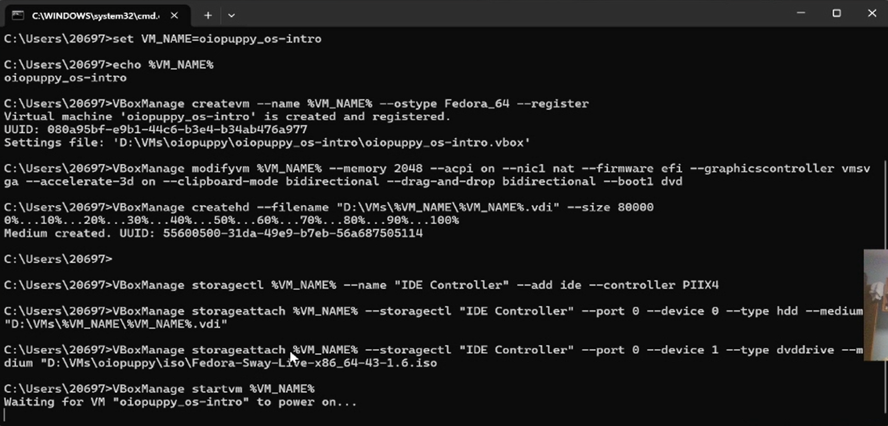
    ```cmd
    set VM_NAME=haoczan2_os-intro
    echo %VM_NAME%
    VBoxManage createvm --name %VM_NAME% --ostype Fedora_64 --register
    VBoxManage modifyvm %VM_NAME% --memory 2048 --acpi on --nic1 nat --firmware efi --graphicscontroller vmsvga --accelerate-3d on --clipboard-mode bidirectional --drag-and-drop bidirectional --boot1 dvd
    VBoxManage createhd --filename "D:\VMs\%VM_NAME%\%VM_NAME%.vdi" --size 80000
    VBoxManage storagectl %VM_NAME% --name "IDE Controller" --add ide --controller PIIX4
    VBoxManage storageattach %VM_NAME% --storagectl "IDE Controller" --port 0 --device 0 --type hdd --medium "D:\VMs\%VM_NAME%\%VM_NAME%.vdi"
    VBoxManage storageattach %VM_NAME% --storagectl "IDE Controller" --port 0 --device 1 --type dvddrive --medium "D:\VMs\haoczan2\iso\Fedora-Sway-Live-x86_64-41-1.4.iso"
    ```
**Результат:** Виртуальная машина `haoczan2_os-intro` была успешно создана и настроена с 2 ГБ оперативной памяти, виртуальным жестким диском объемом 80 ГБ и смонтированным образом Fedora ISO.

### 2.4 Шаг 4: Запустите виртуальную машину и войдите в рабочую среду.
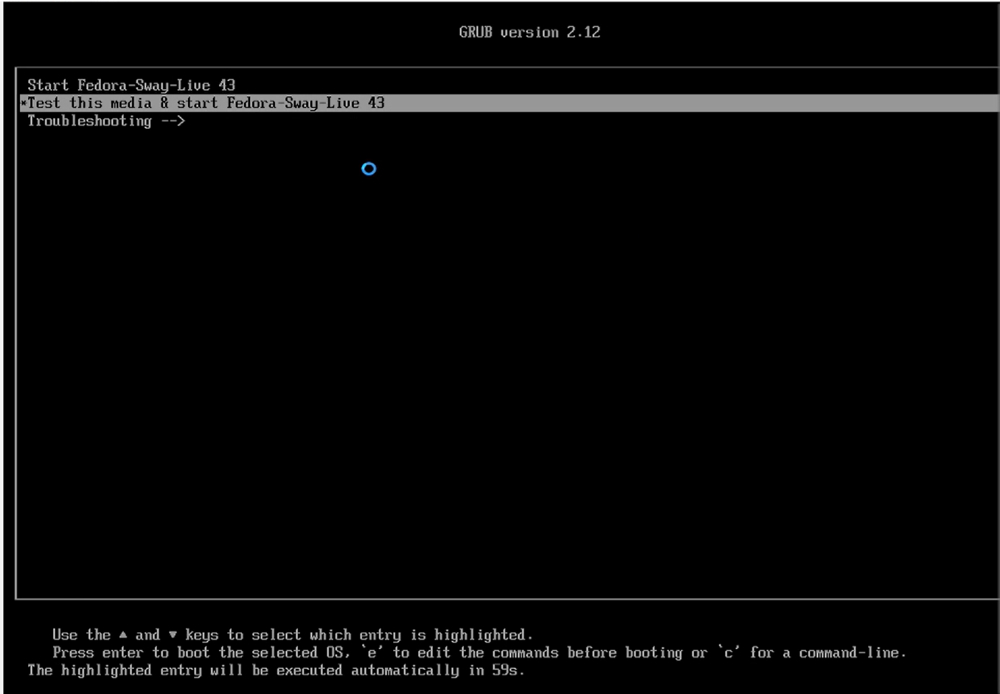
* **Команда:** `VBoxManage startvm %VM_NAME%`
* **Результат:** Успешно загружен рабочий стол Fedora Live и запущен графический установщик.

### 2.5 Шаг 5: Настройка параметров установки
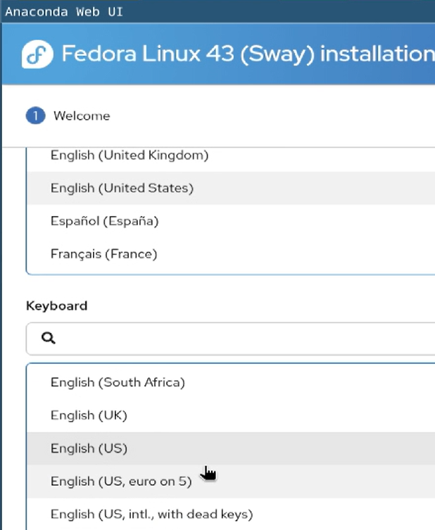
- Язык: Английский (США)
- Часовой пояс: Выберите свой регион (например, Азия/Шанхай)
- Раскладка клавиатуры: Добавьте русский язык и установите клавишу переключения на **Правая клавиша Ctrl**
- Место установки: Автоматическое разбиение диска
- Сеть и имя хоста: Установите имя хоста на `haoczan2` и включите сетевой доступ
- Настройки пользователя: Установите пароль root, создайте обычного пользователя `haoczan2` и предоставьте ему права администратора
* **Результат:** После настройки всех параметров установки нажмите «Начать установку», чтобы начать установку.

### 2.6 Шаг 6: Процесс установки и перезапуск
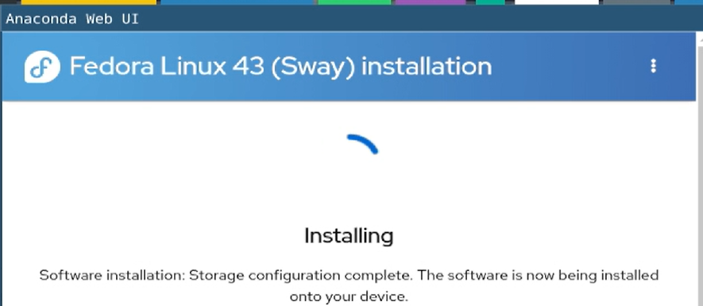
* **Результат:** Успешно загружен с жесткого диска, вошел в меню Grub, выбрал Fedora Linux и вышел на рабочий стол.

### 2.7 Шаг 7: Настройка после установки
#### 2.7.1 Установите дополнения для гостевой системы VirtualBox.
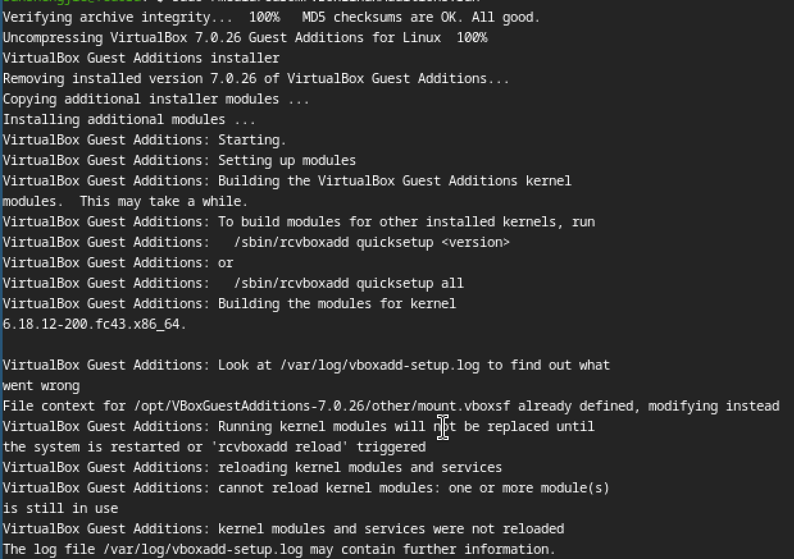
    ```bash
    sudo -i
    dnf -y group install "Development Tools"
    dnf -y install dkms kernel-devel
    mount /dev/sr0 /media
    /media/VBoxLinuxAdditions.run
    reboot
    ```
**Результат:** Приложение Guest Additions успешно установлено, и такие функции, как интеграция с мышью и обмен буфером обмена, работают корректно.

#### 2.7.2 Обновите систему и установите часто используемые инструменты.
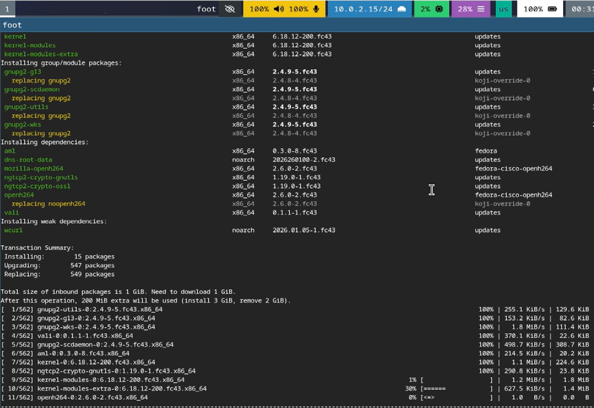
    ```bash
    sudo -i
    dnf -y update
    dnf -y install tmux mc kitty
    ```
**Результат:** Система обновлена ​​до последней версии, и установлены часто используемые инструменты.

#### 2.7.3 Отключить SELinux
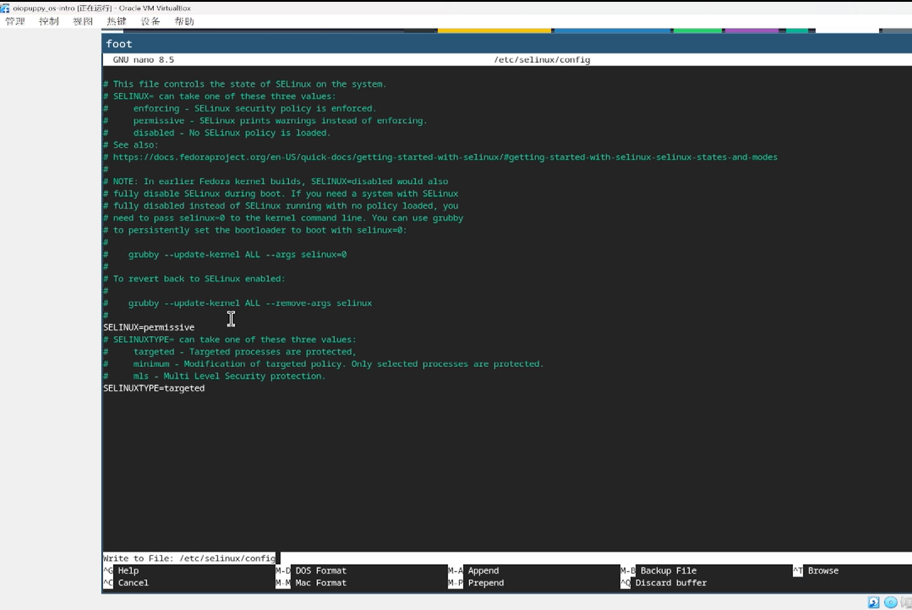
    ```bash
    nano /etc/selinux/config
    ```
    Измените `SELINUX=enforcing` на `SELINUX=permissive`, сохраните изменения и перезапустите систему.
**Результат:** SELinux переключается в разрешающий режим.

#### 2.7.4 Настройка сохранения раскладки клавиатуры
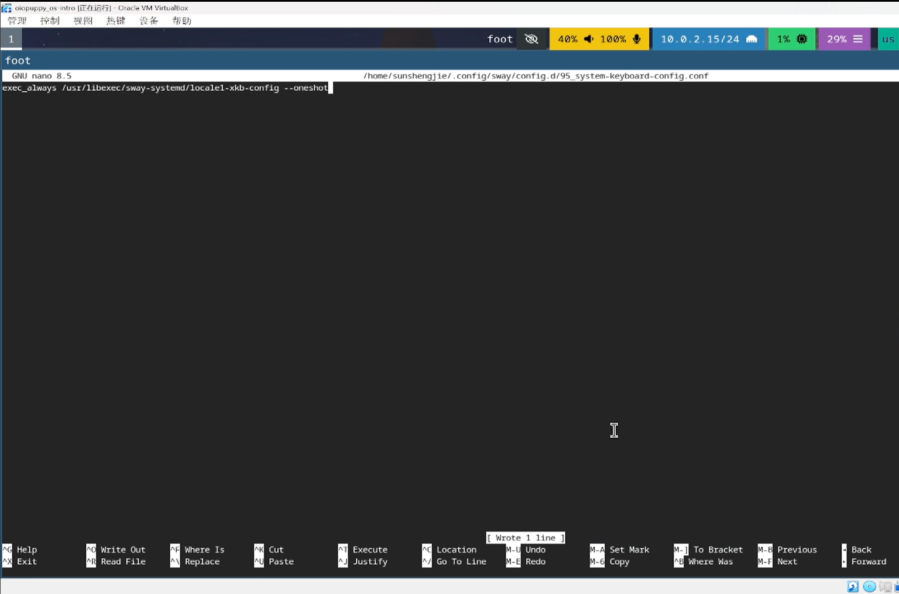
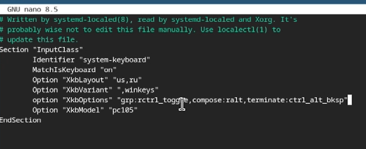
    ```bash
    mkdir -p ~/.config/sway/config.d
    nano ~/.config/sway/config.d/95-system-keyboard-config.conf
    ```
    Писать：`exec_always /usr/libexec/sway-systemd/locale1-xkb-config --oneshot`
    ```bash
    sudo -i
    mkdir -p /etc/X11/xorg.conf.d
    nano /etc/X11/xorg.conf.d/00-keyboard.conf
    ```
    Запишите конфигурацию (включая `grp:rctrl_toggle`), сохраните и перезапустите.
* **Результат:** После перезапуска вы можете использовать клавишу Ctrl для переключения между английской и русской раскладками.

### 2.8 Глава 8: Домашнее задание - Анализ dmesg
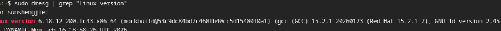
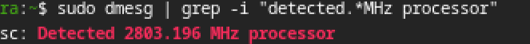
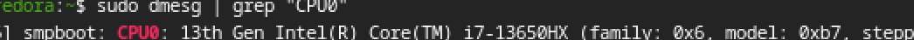
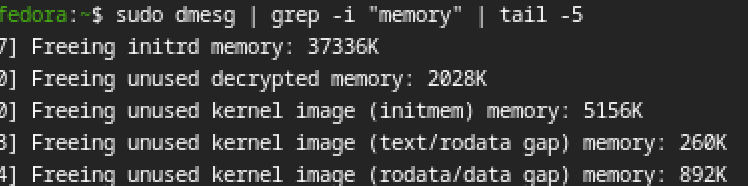
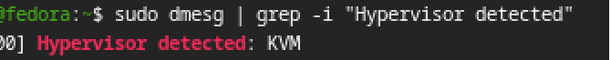
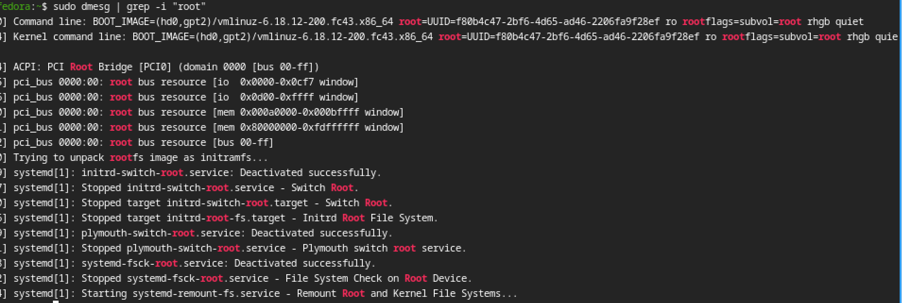
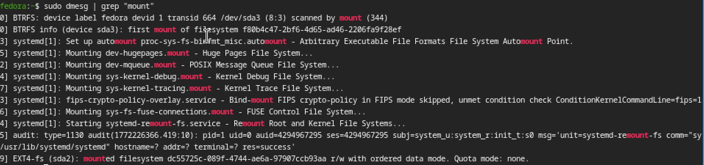
* **Команды и вывод:**
    ```bash
    dmesg | grep "Linux version"
    dmesg | grep -i "detected.*MHz processor"
    dmesg | grep "CPU0"
    dmesg | grep -i "Memory available"
    dmesg | grep -i "Hypervisor detected"
    dmesg | grep "VFS: Mounted root"
    dmesg | grep "mount"
    ```
**Результат:** Информация, включая версию ядра, частоту процессора, модель процессора, доступную память, тип гипервизора, тип корневой файловой системы и порядок монтирования файловых систем, получена успешно. В выводе указано, что система работает в среде виртуальной машины VirtualBox.

## 3. Ответы на вопросы для самопроверки

1. **Учётная запись пользователя содержит какую информацию?**  
   Учетные записи пользователей обычно содержат следующую информацию: имя пользователя, идентификатор пользователя (UID), идентификатор группы (GID), путь к домашнему каталогу, оболочка по умолчанию, заполнитель пароля (фактически зашифрованный и хранящийся в `/etc/shadow`) и необязательное полное имя. Эта информация в основном хранится в файле `/etc/passwd`.

2. **Укажите команды терминала и приведите примеры:**  
   - **Получить справку:** `man ls` (Отображает руководство по команде `ls`)
   - **Переместить:** `cd /tmp` (Перейти в каталог `/tmp`)
   - **Просмотреть содержимое каталога:** `ls -la` (Выводит список всех файлов и их     подробную информацию)
   - **Просмотреть размер каталога:** `du -sh ~` (Отображает общий размер домашнего каталога)
   - **Создать/Удалить:** `mkdir testdir` (Создает каталог), `rmdir testdir` (Удаляет пустой каталог), `touch file.txt` (Создает файл), `rm file.txt` (Удаляет файл)
   - **Изменить права доступа:** `chmod 755 script.sh` (Устанавливает права на чтение, запись и выполнение для владельца, а также на чтение и выполнение для группы и других пользователей)
   - **Просмотреть историю:** `history` (Отображает историю команд)

3. **Что такое файловая система? Приведите примеры с краткой характеристикой.**  
   Файловая система — это метод и структура данных, используемые операционной системой для определения файлов на устройстве хранения (например, жестком диске) или разделе; другими словами, это способ организации файлов. Распространенные примеры:
   - **ext4**：Встроенная в Linux файловая система с журналированием поддерживает большие файлы, обеспечивает высокую производительность и обладает хорошей совместимостью.
   - **XFS**：Высокопроизводительная 64-битная файловая система с журналированием, отлично справляющаяся с обработкой больших файлов и высокой параллельной обработкой.
   - **btrfs**：Современные файловые системы с механизмом копирования при записи поддерживают расширенные функции, такие как моментальные снимки, сжатие и контрольные суммы.
   - **NTFS**：В Windows файловая система по умолчанию поддерживает большие файлы, контроль доступа и журналирование.
   - **FAT32/exFAT**：В основном используется для мобильных устройств, таких как USB-флеш-накопители, и обладает широкой совместимостью, но exFAT поддерживает файлы больших размеров.

4. **Как посмотреть, какие файловые системы подмонтированы в ОС?**  
   Команды `mount` или `df -hT` позволяют просмотреть информацию о текущих смонтированных файловых системах, их точках монтирования, типах и объемах.

5. **Как удалить зависший процесс?**  
   Сначала используйте команду `ps aux | grep process_name`, чтобы найти PID процесса, а затем отправьте сигнал на его завершение：
   - изящное завершение：`kill PID`
   - Принудительное прекращение (применимо к приостановленным процессам)：`kill -9 PID`

# Выводы

В ходе этого практического занятия я успешно завершил весь процесс установки виртуальной машины Fedora Sway на хост-систему Windows с помощью VirtualBox. Мои основные выводы следующие：

1. **Освоил основные принципы работы технологии виртуализации:**：Я научился создавать, настраивать и управлять виртуальными машинами, включая параметры памяти, жесткого диска, сети и EFI.
2. **Знаком с процессом установки системы Fedora**：От загрузки в Live-среду до использования графического установщика (Anaconda), включая разметку диска, создание пользователей, настройку раскладки клавиатуры и т. д.
3. **Разберитесь в базовой конфигурации после запуска системы**：Для расширения функциональности виртуальной машины была установлена ​​программа VirtualBox Guest Additions, система была обновлена, установлены часто используемые инструменты, а SELinux был отключен для упрощения последующих операций.
4. **Научился сохранять настройки раскладки клавиатуры на постоянной основе**：Изменение конфигурационных файлов sway и X11 позволяет сохранить действие переключения раскладки клавиатуры (правая клавиша Ctrl) после перезагрузки.
5. **Освойте использование команды dmesg**：Анализируя информацию о запуске системы, мы получили ключевые данные об оборудовании, такие как версия ядра, процессор, память и гипервизор, что углубило наше понимание процесса запуска Linux.
6. **Улучшена поддержка основных команд Linux.**：При ответе на вопросы, касающиеся управления, были рассмотрены часто используемые команды, такие как операции с файлами, управление правами доступа и управление процессами.

Все экспериментальные задачи выполнены. Я не только освоил метод установки Linux в виртуальной машине, но и заложил прочный фундамент для дальнейшего углубленного изучения операционных систем и системного администрирования.
