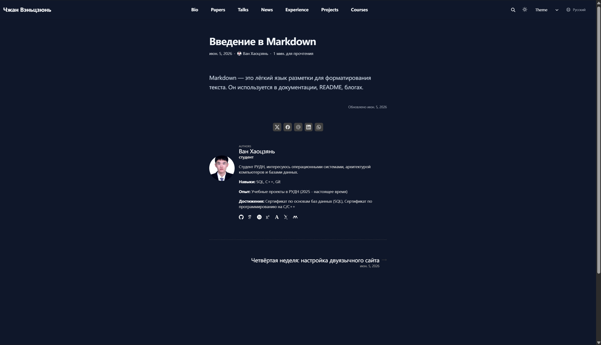

# 1. Цель работы

Реализовать поддержку двух языков (русского и английского) на персональном сайте с использованием Hugo, разместить контент на обоих языках, создать пост о прошедшей неделе и тематический пост на двух языках.

# 2. Этапы выполнения проекта

## 2.1. Настройка поддержки двух языков

В файле `config/_default/languages.yaml` настроены русская и английская версии сайта.

```yaml
ru:
  languageCode: ru-RU
  languageName: Русский
  contentDir: content/ru
  title: "Ван Хаоцзянь | Персональный сайт"
  weight: 1

en:
  languageCode: en-US
  languageName: English
  contentDir: content/en
  title: "Wang Haojian | Personal website"
  weight: 2
```

## 2.2. Создание структуры каталогов

Созданы каталоги для мультиязычного контента:

```text
content/ru/
content/en/
```

Внутри были созданы подкаталоги:

- authors
- blog
- project
- home

После этого существующий контент был переведён на английский язык.

## 2.3. Адаптация авторской информации

Для английской версии создан файл:

```text
content/en/authors/me/_index.md
```

Содержание файла:

```markdown
---
title: "Wang Haojian"
role: "student"
bio: "RUDN student, interested in operating systems and computer architecture."

interests:
  - Operating Systems
  - Computer Architecture

education:
  courses:
    - course: "Bachelor's degree (02.03.00)"
      institution: "RUDN University"
      year: 2025
---
```

## 2.4. Создание постов на двух языках

### 2.4.1. Пост о прошедшей неделе

Созданы файлы:

```text
content/ru/blog/week4-bilingual/index.md
content/en/blog/week4-bilingual/index.md
```

Русская версия:

```markdown
---
title: "Четвёртая неделя: настройка двуязычного сайта"
date: 2026-05-26
authors:
  - me
---

На этой неделе я настроил поддержку двух языков.
Сайт теперь доступен на русском и английском языках.
```



*Рисунок 1: Русская версия поста*

### 2.4.2. Тематический пост о Markdown

Созданы файлы:

```text
content/ru/blog/markdown-bilingual/index.md
content/en/blog/markdown-bilingual/index.md
```

В постах описаны возможности языка разметки Markdown и особенности его использования при создании документации и блогов. Тематический пост включает примеры форматирования текста, вставки изображений и работы с кодом.

# 3. Заключение

В результате выполнения этапа:

- Настроена поддержка двух языков
- Создана структура каталогов для мультиязычного контента
- Переведена авторская информация
- Созданы посты на русском и английском языках
- Размещён тематический пост с примерами Markdown

Сайт успешно опубликован на GitHub Pages.

Адрес сайта:

```text

```
